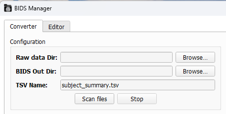
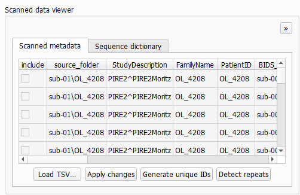
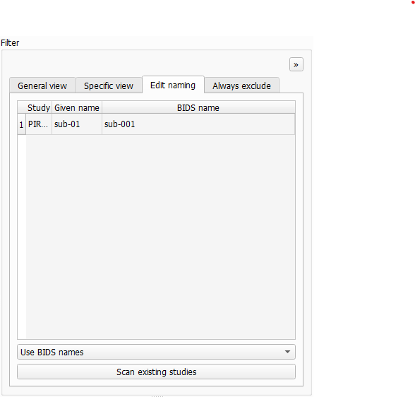
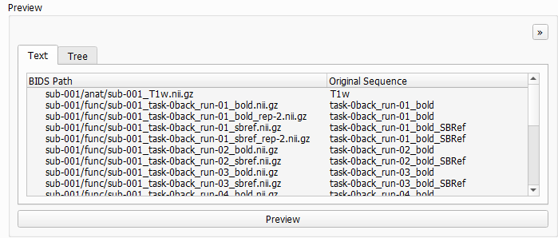
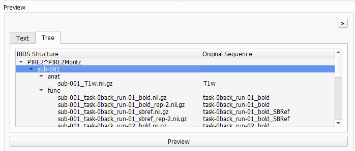

# Converter Tab

The first tab you'll see in BIDS-Manager is the `converter tab`. This is where you can `scan` your raw data, identify different patterns and run the `conversion` into a BIDS compliant dataset.


```{admonition} Visual settings
:class: tip
* You can change the color palette of the GUI with the icon in the lower-left corner. High-contrast themes are also available. This only affect the appearance, it will be saved for future sessions.
* The `DPI` (dots per inch) setting in the lower-left corner lets you scale the display to match your PC's resolution. Very high DPI values might give issues, not recommended to be set 50% higher than your PC's resolution. This only affect the appearance, it will be saved for future sessions.
* Each section can be resized by dragging its edges. 
* Each section can be undocked by clicking on the `>>` icon (top-right corner). Closing the undocked window will dock it back.
* The whole GUI can also be resized by dragging from the edges. If you want to make it very small, you can try undocking some sections.

```

## Configuration




To scan your dataset, first you need to fullfill the `Configuration` section:
- **Raw data Dir:** You can paste the path or `browse` to select your datasets folder. BIDS-Manager can work simulatenusly with datasets from different studies at the same time.
- **BIDS Out Dir:** You can paste the path or `browse` to select the folder where you want to save the converted output (the BIDS-compliant dataset). 
- **TSV Name:** Everytime you scan your dataset, you create a _.tsv_ file with a summary of your scanned files and the conversion settings. You can edit the name, but the default is _"subject_summary.tsv"_.

Once you have defined the different configuration parameters, you can press in `Scan files`. Both the terminal and the `Log Output` section will show some updates in the process of scanning your dataset and the creation of the TSV file.


## Scanned Data Viewer
This section is divided in 2 sub-sections:
* Scanned metadata
* Sequence dictionary

### 1. Scanned metadata


This sections summarizes your uploaded raw data, including subjects, sessions, sequence types and their proposed BIDS conversion.
* `source_folder`: Path to the folder that contains this file. The **root** is the raw-data directory you selected when loading the dataset.
* `StudyDescription`: The name of the Study, there can be several in your raw data directory. This becomes the **root name** in the final BIDS conversion. There can be errors if different machines were used. You can edit it by double-clicking.
* `FamilyName` & `PatientID`: They are often identical. If the experimenter forgot to add or change the IDs between recordings, BIDS-Manager will be able to identify the different subjects. You can edit it manually or click on `Generate unique IDs` to assign unique identifiers per `FamilyName`.
* `BIDS Name`: Subject label in the BIDS conversion. Ensure it is consistent after any changes in `FamilyName` or `PatientID`. Also editable.
* `session`: Shows the sessions detected in your dataset. If auto-detection fails, edit the values manually.

```{admonition} Edition tips
:class: tip

* You can drag the small square in the lower-left corner of a cell to copy its value vertically to other rows. This works for all editable fields in this section.


* Click on `Apply changes` to save your edits on the _"subject_summary.tsv"_.
* **Warning:** The `include` checkbox allows you to select what to include in the final BIDS conversion, but this **is not recommended**. Use the `filter` section instead.
* `fmap` files sometimes get missclassified as _"misc\"_ in the scanner data viewer. This label **does not carry over** to the final BIDS conversion.

```


More options:
* `Load TSV...`: lets you reload a dataset by browsing their _"subject_summary.tsv"_. This skips the scanning process, which can take a lot of time. You still need to set the **Raw data Dir** and the **BIDS Out Dir**.
* `Detect repeats`: the `rep` column will show a **2**, which means that this entry is the latest version (common when a run is interrupted and restarted). Sometimes this will be done automatically when you scan the file.

### 2. Sequence dictionary


Each tab corresponds to a **BIDS sequence type** and lists the keywords that BIDS-Manager uses to recognize it.
* You can use the `Add` and `Remove` buttons to edit these keywords and include any specific naming patterns you use in your own datasets.
* All changes will be saved for following sessions. The changes are stored in the _"user_preferences.tsv"_ file within the environment of your BIDS-Manager.

```bash
path\to\BIDS_MANAGER\env\Lib\site-packages\bids_manager\user_preferences
```

* If you want to undo modifications or fix mistakes, use the `Restore defaults` option to return to the original keyword list.
 
## Filter

This section is divided into 4 sub-sections:
* General view
* Specific view
* Edit naming
* Always exclude
 
### 1. General view


It displays all of the patterns detected in all subjects, organized and classified by **BIDS sequence types** (anat, func, fmap, dwi..). Under each modality you'll see the specific types of images and runs that were detected during scanning. You can check and uncheck which ones you want to include in the final BIDS converted dataset.


```{admonition} Repeated sequences

If a sequences shows (rep2) next to its name, it means that it's a duplicated. If you include both, they will be included as run-1 and run-2.

``` 


### 2. Specific view


This view is similar to the General view, but you here can select *specific files per subject*.

```{admonition} Repeated sequencees

The option `Only last repeats` automatically keeps the most recent version of each duplicate and deselect the older ones.
Be aware, this might overwrite some changes done in the General view.

```

### 3. Edit naming


This pannels displays both the **BIDS name** and the **Given Name** (e.g. the codeword used during participant recruiting). Use this section to verify that participants are not misassigned. You can also manually modify the BIDS name or the given name if correction are needed.
The dropdown below lets you choose between `Use BIDS name` or `Use given name`, but note that selecting the Given Name option won't be BIDS compliant.

 ### 4. Always exclude


BIDS-Manager has a list of common scan patterns that are usually not necesary and exclude them automatically during scanning. You can add new **patterns manually** so they won't be scan in your next session.

All new patterns will be stored in a tsv file within your BIDS-Manager environment:

```bash
path/to/BIDS_MANAGER\env\Lib\site-packages\bids_manager\user_preferences
```

 ## Preview


In this section, you can click on `Preview` to see how your dataset will look like once converted into BIDS format.
* The **Text tab** will show a list of generated file paths.
* The **Tree tab** provides a hierarchical view, organized by subjects, modalities (dwi, anat, func...) and each file with its final BIDS compliant name.




## Run conversion


Finally, once you have chosen your conversion parameters, you can proceed to run the conversion. Click `Run` to start converting your dataset into a BIDS-compliant structure. The Log Output and the Terminal will provide real-time updates on the progress and any issues encountered.
When the process completes, you will find your converted dataset in the directory specified as the BIDS Output Directory.


```{admonition} Next section
:class: tip

In the next section we will get see how to navigate and edit metadata (`json` and `tsv` files) as well as view and scroll through sequence types (`nii` and `gz` files) thanks to the Editor Tab.

``` 


