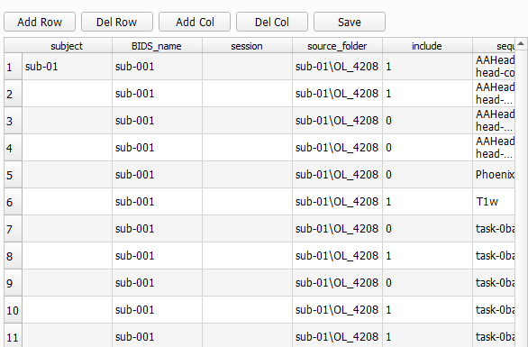

# Editor Tab
The second tab in BIDS-Manager is the `editor tab`. 

## Load your dataset
Go to the top menu and click `File`, in the dropdown select `Open BIDS...`, then a file browser will appear. Navigate to the **root or absolute folder** of your BIDS dataset (the top-level directory that contains all subfolders).

Once you've load your dataset, **BIDStatistic** will show you a summary of your dataset, such as total amount of subject, total amount of files. And from each subject, the amout of sessions and sequence types.

## BIDSplorer
Once you've load your dataset, you can use BIDSplorer to easily navigate through your folder and open, view and edit different type of files and sequence types.

* **Metadata:** You can double on the _json_ and _tsv_ files to see them and edit them.

