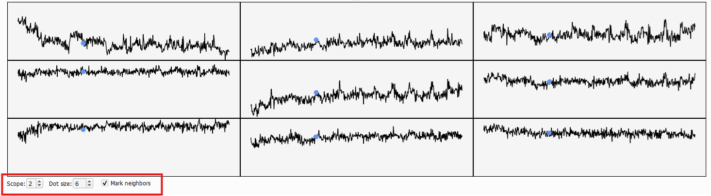

# Editor Tab
The second tab in BIDS-Manager is the `Editor`. It lets your preview and edit metada (`.json` and `.tsv` files) and imaging data (DICOMS, NIfTI volumes...).


## Load your dataset
Go to the top menu and click `File`, in the dropdown select `Open BIDS...`, then a file browser will appear. Navigate to the **root or absolute folder** of your BIDS dataset (the top-level directory that contains all subfolders).


Once you've load your dataset, **BIDStatistic** will show you a summary of your dataset, such as total amount of subject, total amount of files. And from each subject, the amout of sessions and sequence types.


## BIDSplorer
Once you've loaded your dataset, you can use BIDSplorer to easily navigate through your dataset subfolders and view different type of files and sequence types.


* `.bids_manager:` Hidden folder, it contains:
 *  **"subject_mapping.tsv":** simple list of all subjects, without age and gender.
 *  **"subject_summary.tsv":** all data scanned, metada and sequences types, and the rules to include it or not. 
* `.heudiconv`: stores the heudiconv files used for the conversion heuristics. 
* **Metadata:** Double-click on the `json` and `tsv` files to open them. Then, you can scroll through their contents and make edits:
  * For `json` files, you can easily `Add` and `Delete Fields`.
  * For `tsv` file, you can `Add` and `Remove` `Columns` and `Rows`.
  * Changes can be saved with the `Save` button (it overwrites the original file).


  
* **Sequence type view:** `nii` and `gz` files can be opened with BIDSplorer as well. You can freely inspect voxel values with the `Volume` toggle, switch between views (Sagittal, Coronal or Axial). You may also adjust the brightness and contrast.


  * **Graph view:** some files include a `Graph` option (top-up), which allows you to see the signal over time. Usse the `Volume` toggle to scroll throught different time points of the signal. The graph below will help you spot "jumps" or irregularities caused by participant movement or scanner errors.


  * **Neighbors:** Increse the `scope` option (bottom-down) to inlcude neighboring voxels, making it easier to identify localized artifacts. You may additionally increase the dot size and even remove the dot from the neighboring graphs.




```{admonition} Next section
:class: tip

In the next section we will get see how to use the different tools of the Editor tab to rename batches of files, add fieldmap images to function images, and more.

``` 

