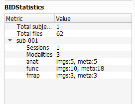

# Editor Tab
The second tab in BIDS-Manager is the `Editor`. It lets your preview and edit metada (_.json_ and _.tsv_ files) and imaging data (_DICOMS, NIfTI_ volumes...).


## Load your dataset
Go to the top menu and click `File`, in the dropdown select `Open BIDS...`, then a file browser will appear. Navigate to the **root or absolute folder** of your BIDS dataset (the top-level directory that contains all subfolders).


 <br>

Once you've load your dataset, **BIDStatistic** will show you a summary of your dataset, such as total amount of subjects and files, as well as sessions and sequence types per subject.



 <br>

```{admonition} Note for macOS users

On macOS, the `File` and `Tools` menus are not inside the BIDS Manager window, instead they appear in the system menu bar at the top of the screen. 

 

```

## BIDSplorer
Once you've loaded your dataset, you can use BIDSplorer to easily navigate through your dataset subfolders and view different type of files and sequence types.


 <br>

* **Metadata and Sidecars:** Double-click on the _json_ and _tsv_ files to open them, review them and modify entries.
  * For _tsv_ files, you can `Add` and `Remove` `Columns` and `Rows`.
  * For _json_ files, you can easily `Add` and `Delete Fields`, without opening a text editor and manually editing.


  * Changes can be saved with the `Save` button (it overwrites the original file).

 <br>

```{admonition} Hidden Folders
BIDSplorer also let you access hidden folders such as:
 * `.bids_manager`: which contains the following tsv files:
   * _subject_mapping.tsv_: simple list of all subjects, without age and gender.
   * _subject_summary.tsv_: all data scanned, metada and sequences types, and the rules to include it or not.
 * `.heudiconv`: stores the the conversion heuristics files.
```

 <br>
   
* **Sequence type view:** BIDSplorer can open NIfTI images (_.nii/.nii.gz_) across different sequence types (_anat, func, fmap, dwi_). Use the different option to
  * Inspect the three orthogonal planes with the `Axial`, `Coronal` and `Sagittal` buttons.
    


 <br>

  * Scroll through the 2D cross-sections of the current plane with the `Slices` toggle.
    


 <br>

  * Adjust `brightness` and `contrast` to improve visibility.
    


 <br>

  * For **functional (BOLD) images**, you can scroll through time using the `volume` toggle.
    


 <br>
 
  * BIDSplorer includes a `Graph` option for functional images that allows to see the how the signal changes over time. The graph along with the `volume` toggle will help you spot "jumps" or big irregularities that could be cause by the participant movements or scanner artifacts.
    


 <br>

  * Expand the graph with the `Scope` option (at the bottom of the screen) to include neighboring voxels, which can make artifacts easier to localize. You can also adjust the `Dot size` or hide the neighboring dots.
    


 <br>

## Next section

In the next section we will get see how to use the different tools of the Editor tab to rename batches of files, add fieldmap images to function images, and more.


