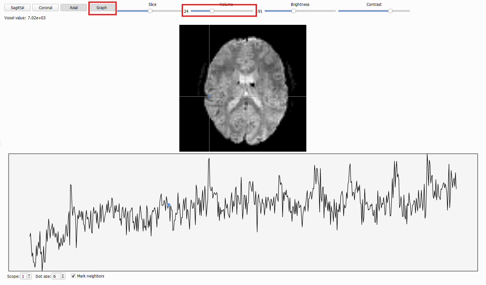

# Editor Tab
The second tab in BIDS-Manager is the `editor tab`. 

## Load your dataset
Go to the top menu and click `File`, in the dropdown select `Open BIDS...`, then a file browser will appear. Navigate to the **root or absolute folder** of your BIDS dataset (the top-level directory that contains all subfolders).

Once you've load your dataset, **BIDStatistic** will show you a summary of your dataset, such as total amount of subject, total amount of files. And from each subject, the amout of sessions and sequence types.

## BIDSplorer

Once you've loaded your dataset, you can use BIDSplorer to easily navigate through your dataset folder and open, view and edit different type of files and sequence types. 

* **Metadata:** Double-click on the `json` and `tsv` files to open theme. Then, you can scroll through their contents, make edits and save changes with the `Save` button (it overwrites the original file).
  * For `json` files, you can easily `Add` and `Delete Fields`.
  * For `tsv` file, you can `Add` and `Remove` `Columns` and `Rows`.

* **Hidden folders:** BIDSplorer also let you access hidden folders such as `.bids_manager` and `.heudiconv`_
  * _.bids_manager:_ it will contain the "subject_mapping.tsv" (list of all subjects) and the "subject_summary.tsv" (with all files per subject). 
  * _.heudiconv:_: stores heuristics. BIDS-Manager creates Python scripts here that record the specific transformation rules used to convert your raw data into BIDS format.

* **Anatomical files:** `nii` and `gz` files can be opened with BIDSplorer as well. You can freely inspect voxel values, switch between views (Sagittal, Coronal or Axial), and scroll though slices and volumes. You may also adjust the brightness and contrast.

  * **Graph view:** some files include a `Graph` option, which allows you to see the signal over time. Usse the `Volume` toggle to scroll throught different time points of the signal. The graph below will help you spot "jump" or irregularities caused by participant movement or scanner errors.

  * **Neighbors:** Increse the `

