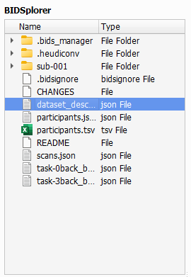
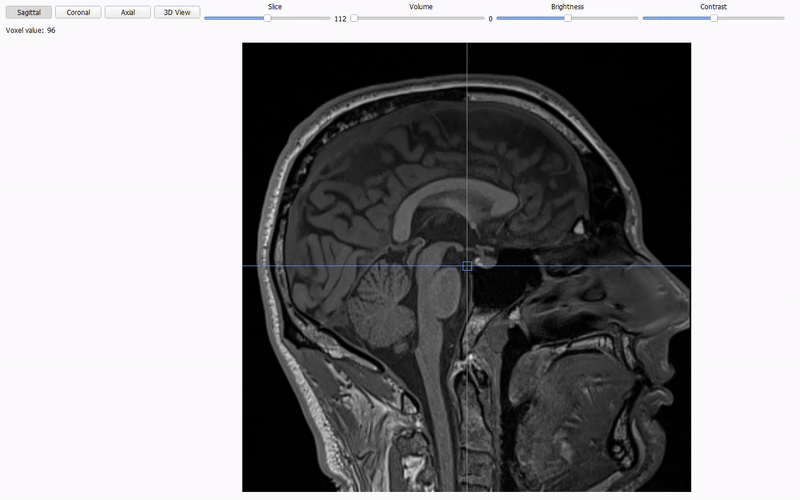

# Editor Tab
The second tab in BIDS-Manager is the `Editor`. It lets your preview and edit metada (`.json` and `.tsv` files) and imaging data (DICOMS, NIfTI volumes...).


## Load your dataset
Go to the top menu and click `File`, in the dropdown select `Open BIDS...`, then a file browser will appear. Navigate to the **root or absolute folder** of your BIDS dataset (the top-level directory that contains all subfolders).


 <br>

Once you've load your dataset, **BIDStatistic** will show you a summary of your dataset, such as total amount of subject, total amount of files. And from each subject, the amout of sessions and sequence types.


 <br>

## BIDSplorer
Once you've loaded your dataset, you can use BIDSplorer to easily navigate through your dataset subfolders and view different type of files and sequence types.



 <br>

* **Metadata:** Double-click on the `json` and `tsv` files to open them. Then, you can scroll through their contents and make edits:
  * For `json` files, you can easily `Add` and `Delete Fields`.
  * For `tsv` file, you can `Add` and `Remove` `Columns` and `Rows`.
  * Changes can be saved with the `Save` button (it overwrites the original file).


 <br>

```{admonition} Hidden Folders
BIDSplorer also let you access hidden folders such as:
 * `.bids_manager`: which contains the following tsv files:
   * _subject_mapping.tsv_: simple list of all subjects, without age and gender.
   * _subject_summary.tsv_: all data scanned, metada and sequences types, and the rules to include it or not.
 * `.heudiconv`: stores the the conversion heuristics files.
```

 <br>
   
* **Sequence type view:** BIDSplorer can open NIfTI images (`nii`/`.nii.gz`) across different sequence types (anat, func, fmap, dwi). You can:
  * Inspect the three orthogonal planes: `Axial`, `Coronal`, `Sagittal`.


 <br>

  * Navigate `Slices`:
    

 <br>

  * Adjust `brightness` and `contrast` to improve visibility


 <br>

  * For **functional (BOLD) images** you can scroll through time (4-D data) using the `volume` toggle.


 <br>
 
  * On top of the volume function, BIDSplorer includes a `Graph` option that allows to see the how the signal changes over time. This graph will help you spot "jumps" or big irregularities that could be cause by the participant movement or scanner errors.


 <br>

  * The `Graph` option can also be expanded with the `Scope`option to inlcude neighboring voxels, making it easier to identify localized artifacts. You may additionally increase the `Dot size` and even remove the dot from the neighboring graphs.


 <br>

```{admonition} Next section
:class: tip

In the next section we will get see how to use the different tools of the Editor tab to rename batches of files, add fieldmap images to function images, and more.

``` 

