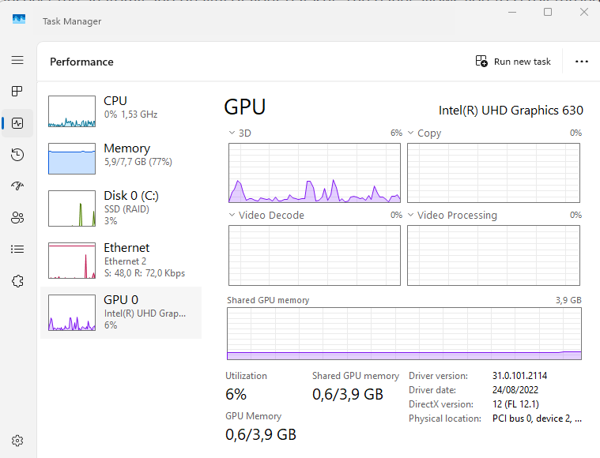
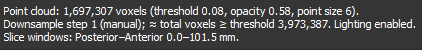
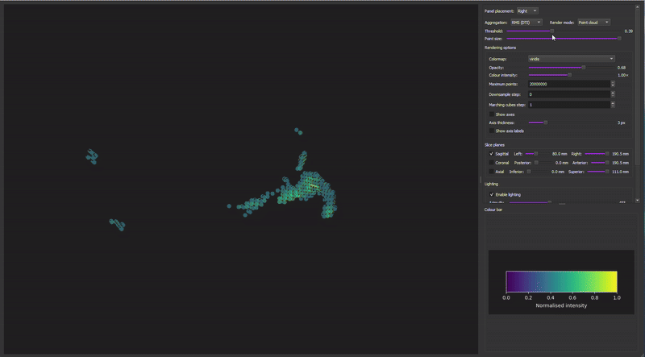
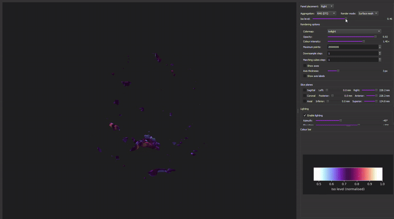
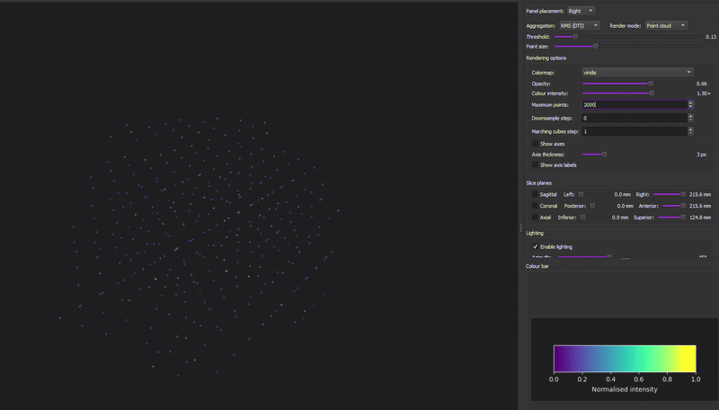
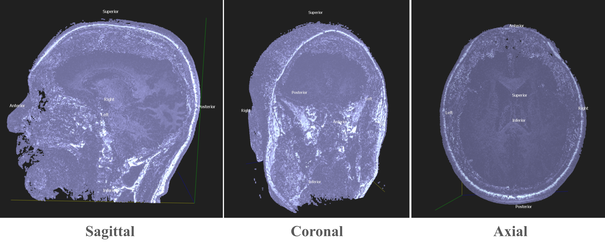

# 3D Viewer


Every _nifti_ file has the `3D View` button that opens a new window that allows you to quickly visualize and inspect the anatomy and quality of your dataset. The panel allows you to scroll through slices, switch the render mode or intensity ranges.

```{admonition} Visual settings
:class: tip
* Any change you make here only affects the visualization, it won't affect the data. So feel free to explore what parameters work better for your visualization. 
* You can zoom in and out with the scroll wheel. You can rotate the figure by clicking and dragging.
* It requires GPU (integrated or discreted) for graphics smooth interaction. Check your `Task Manager`, usually in the `Performance` window to check if your sytem counts with one. If your system doesn't count with one, the 3D View will remain empty.

<!--

-->

* At the end of the _Settings Panel_ you'll find a summary of your visualization parameters, so you can save them for future visualizations. For a similar 3D view above, the summary could look like:



```

* **Panel Placement:** You can decide the placement of the _Settings Panel_ within the screen: `Bottom`, `Right` or `Left`. 
* **Aggregation:** As many NIfTI files are 4D, aggregation tells how to collapse them into a single 3D render. Depending on your type of sequence, you have access to different types of aggregation. 
  * **Anatomical (anat) & Fieldmap: (fmap):** the only available type of aggregation is `Intensity`, as there is not a 4th dimension. 
  * **Diffusion (dwi) & Functional (func):** you can _often_ choose different aggregation types: `Mean value`, `RMS DTI` (Root Mean Square), `Max value`, `First volume`. Mean and RMS aggregation are similar, Max value will help you spot outliers. 
  
* **Render Mode:** You can decide in-between `Point Cloud` or `Surface Mesh`, they have different adjustable parameters.
  * `Point Cloud`: Renders visible scattered voxels as points. You can control the following visual parameters:
    * **Threshold:** `[0 1]` Minimun normalised intensity (see Color bar) to show as a point. If it is too high, the visualization will be black-empty; lower values are preferable, but if it's too low you'll see the entire volume box.
    * **Point size:** visual diameter of each point. Larger sizes fill gaps and make surfaces look more solid. If you double click, it will go maximun.
      


<br>
<br>


   * `Surface Mesh`: extracts an iso-surface and displays it as three dimensional triangles that connect points with similar values.
     * **Iso level:** `[0 1]` Target intensity level for the iso-surface. Lower levels capture better softer tissues, and higher levels bone structures.
       


<br>
<br>

## Rendering Options
* **Colormap:** Select the matplotlib for voxel normalised intensities. You can see the colour bar at the end of the setting panels. `Bone` is recommended because it's like the recording view.
* **Opacity:** `[0 1]` Global alpha applied to rendering points or surface mesh. Values close to 0 are very transparent and 1 means no transparency applied at all.
* **Colour Intensity:** `[0.1 2]` Makes colours appear dimmer or brighter. The colour bar (at the bottom of the panel) shows the updated normalised intensity colours. High values are recommended.
* **Maximun points _(only for point cloud)_:** `[1000 20 million]` How many voxels become points. The higher, the denser it gets; it makes surfaces more defined, but it can slow down your system.
  

  
* **Downsample step:** `[0, 1, 2...]` controls how many voxels are skipped before rendering. `[0]` is the default, `[1]` is the "native" resolution, no downsampling, it is most detailed view, but heaviest to render (it might slow down the PC), `[2+]` only every _n_-th voxel is render, lowers the spatial resolution but easier to render.

* **Marchings cubes step _(only for surface mesh)_:** `[0, 1, 2...]` Sampling stride used when computing iso-surfaces. It's a different type of downsampling step. Lower values produces smoother and more detailed surfaces but requires heavier computation.

## Axes

* **Show axes:** ☑️ Activates the display of the 3D anatomical axes (x, y, z).
* **Axis thickness:** `[1-12]` Adjust the line width of the displayed axes.
* **Show axis label:** ☑️ Activates text labels for anatomical directions (Superior, Posterior, Anterior, Inferior, Right, Left).


## Slice planes:
Select a single anatomical slice plane and scroll through the volume. This view is useful for checking overall data quality, anatomical structures or specific artifacts.
*  **Sagittal:** ☑️  Left - Right slices (side view)
*  **Coronal:** ☑️ Posterior - Anterior slices (fron/back view)
*  **Axial:** ☑️ Inferior - Superior slices (top-down view)



<br>

## Lightning _(only for surface mesh)_
* **Enable lightning:** ☑️ Turns shading on or off for the surface mesh and allows control of the angle. 
* **Azimuth:** `[-180 - +180]` Horizontal angle of the light source (rotation in the left–right direction).  
* **Elevation:** `[-90 - +90]` Vertical angle of the light source.
* **Intensity:** `[0.1x - 3.0x]` Diffuse lightning strength. Higher values make shading and depth contrasts stronger.


```{admonition} Quick visualization tips
:class: dropdown

* Low the `Threshold` until skull/skin becomes continuous.
* If it's speckly, increase `Point Size` or decrease `Threshold` slightly.
* Increase the `Opacity` and `Colour intensity`
* Increase `Maximun Points` and set the `Downsample step` at 1.

```


```{admonition} Go back
:class: tip
Return to the [introduction](https://ancplaboldenburg.github.io/bids_manager_documentation/) of this documentation or go back to the [BIDS-Manager github](https://github.com/ANCPLabOldenburg/BIDS-Manager)

```


