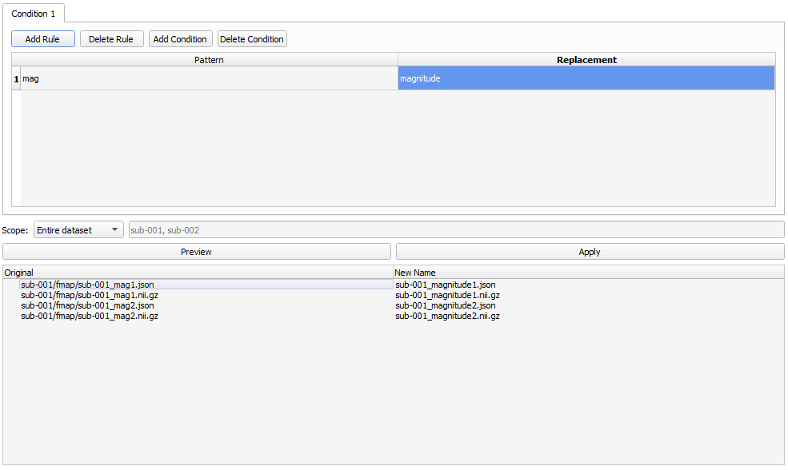
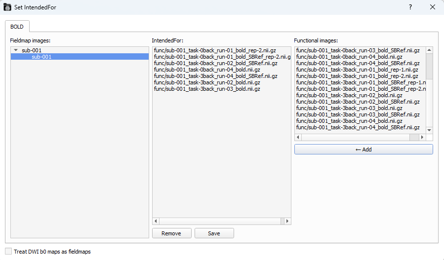
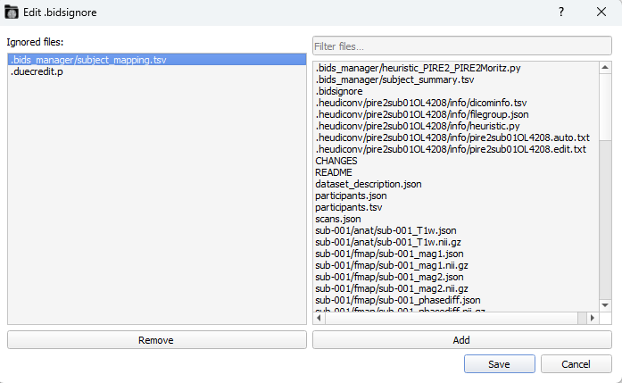

# Tools
The `Editor` tab also has some extra `Tools` to help you to manage your BIDS dataset.


## Batch Rename
Use batch rules to rename files in a batch.
1. Click on `Add Rule` to create a new `Pattern` and `Replacement` pair.
2. Choose the `Scope`: _Entire dataset_ or _Selected subjects_.
3. Click `Preview` to see the original name (left) and the new name (right).
4. `Apply` once you're satisfied.



```{warning} 
Your renamed files might not be BIDS-compliant!
```

## Set Intended For
Writes the chosen _functional images_ image path in the _IntendedFor_ field of the _field map's_ _json_ files


1. `Fieldmap images` _(left-window)_: Choose the subjects whose _fieldmap images_ you want to correct.
2. `Functional images` _(right-window)_: The list shows all available _functional images_. Select one or more and click on `Add`.
   * If you add a _functional image_ by error, click on the _functional image_ in the `IntendedFor` window and click on `Remove`.
3. Click `Save` to apply your selection. A pop-up will confirm you that `IntendedFor` was updated.




## Refresh Scans.tsv
Re-scans the loaded BIDS dataset and updates participants' _sub-XXX_scans.tsv_ in case something got erased or added to the converted dataset.

## Edit .bidsignore
If you don't like some files, you can add them to the .bidsignore, so some BIDS-compliant analysis won't include, such as [MEGqc](https://github.com/ANCPLabOldenburg/MEGqc) or fMRIPrep. It also has a files filter.




## Next section! 
In the next section we'll explore how to see your fMRI data in a 3D view.

