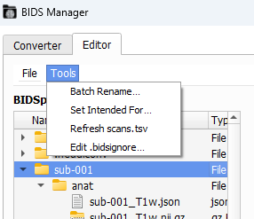

# Tools
The `Editor` tab also has some extra `Tools` to help you to manage your BIDS dataset.




## Batch Rename
Use batch rules to rename files in a batch.
1. Click on `Add Rule` to create a new `Pattern` and `Replacement` pair.
2. Choose the `Scope`: _Entire dataset_ or _Selected subjects_.
3. Click `Preview` to see the original name (left) and the new name (right).
4. `Apply` once you're satisfied.


```{warning} 
Your renamed files might not be BIDS-compliant!
```

## Set Intended For
Link the **fieldmap (fmap)** images of a subject to the functional images they should correct.

<!--
by writting the `IntendedFor` field in the field map's `JSON`.
-->

1. `Fieldmap images` _(left-window)_: Choose the subjects whose _fieldmap images_ you want to correct.
2. `Functional images` _(right-window)_: The list of _functional images_ is created automatically. Select one or more _functional images_ and click on `Add` to select.
   * If you add a _functional image_ by error, click on the _functional image_ in the `IntendedFor` window and click on `Remove`.
3. Click `Save` so BIDS-Manager writes the chosen _functional images_ image path in the _field map's_ _json_ files _IntendedFor_ field. A pop-up will confirm you that `IntendedFor` was updated.


## Refresh Scans.tsv
Scans the BIDS dataset and updates participants' _sub-XXX_scans.tsv_ in case something got erased or added to the converted dataset.

## Edit .bidsignore
Add patterns for files and folders you don't want some BIDS-compliant analysis to include.


